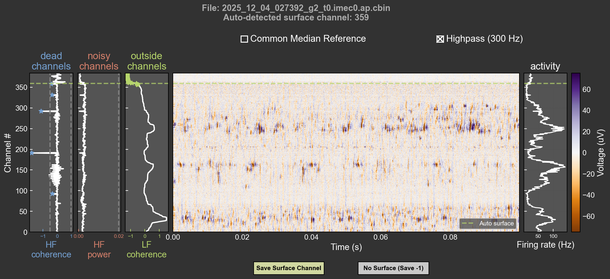

# Surface Detection for Neuropixel Recordings

## Overview

This tool detects the brain surface and bad channels in Neuropixel recordings (SpikeGLX .bin/.cbin). The surface, noisy channel and dead channel detection is based on code that's part of the ibl sorter repository found here: https://github.com/int-brain-lab/ibl-sorter. It provides an automated estimate alongside an interactive visualization, allowing users to verify and adjust the surface channel based on signal features. 

The tool analyzes recordings to classify channels as:
- **Dead channels**: Low signal correlation
- **Noisy channels**: High-frequency (>80% Nyquist) power or excessive correlation
- **Outside channels**: Channels above the brain surface (in air/saline)

The tool is currently limited to data acquired with SpikeGLX. Contact me if you would like me to adapt it to data acquired with OpenEphys.



## Installation

To install the tool locally:

```bash
pip install .
```

## Usage

### GUI file picker

Run without arguments to launch the file picker and options dialog:

```bash
surface-detection
```

### Command Line Mode

```bash
surface-detection /path/to/recording.ap.bin [OPTIONS]
```

### Command Line Options

**File input:**
- `PATH` or `--bin_file PATH` - Path to the .ap.bin or .ap.cbin file

**Detection preprocessing:**
- `--cmr` - Apply Common Median Referencing to data BEFORE running detection algorithms. This interferes with Noisy Channel detection though.
- `--hf FREQUENCY` - Apply highpass filter (Hz) to data BEFORE detection (e.g., `--hf 300`). This might interfere with Noisy/Dead Channel detection.
- `--n_chunks N` - Number of time chunks to analyze (default: 40)
- `--spike_threshold THRESH` - Spike detection threshold in multiples of MAD (default: -6.0)
- `-t` or `--time_slice START END` - Time window to analyze:
    - **Proportions**: Use values <= 1.0 (e.g., `-t 0.0 0.1` for first 10%)
    - **Seconds**: Use values > 1.0 (e.g., `-t 0 600` for first 10 minutes)

**Debug options:**
- `--debug` - Enable debug mode (prints info, saves intermediate .npy)

### Examples

**Basic usage:**
```bash
surface-detection
```

**Analyze specific time window (0-600s) with common median referencing:**
```bash
surface-detection recording.ap.bin --cmr -t 0 600
```

**Debug mode:**
```bash
surface-detection recording.ap.bin --debug
```

## Interactive Plot

The visualization displays the following metrics for surface determination:

1. **Dead Channels**: Channels with very low signal correlation (black stars = dead)
2. **Noisy Channels**: Channels with excessive high-frequency noise (red stars = noisy)
3. **Outside Brain**: Channels with low low-frequency coherence (green stars = outside)
4. **Activity**: Firing rate in Hz (Gold line)
5. **Mean Absolute Voltage (MAV)**: General signal magnitude (uV)
6. **Gamma Power**: Power in 60-100 Hz band (useful for cortex identification)
7. **Spike Amplitude**: Median amplitude of detected spikes

**Interaction:**
- **Heatmap**: Shows raw voltage traces. Controls for CMR and Highpass (300Hz) are checked by default.
- **Click**: Click on any plot to manually set the surface channel.
- **Save**: "Save Surface Channel" writes the result to a text file.

## Output

The tool saves:
- `<filename>.surface_channel.txt` - The detected (or manually selected) surface channel number.
- `<filename>.debug.npy` - (If `--debug`) Dictionary of computed features.
